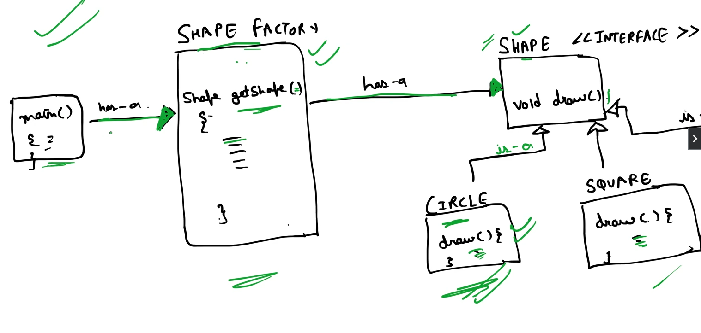
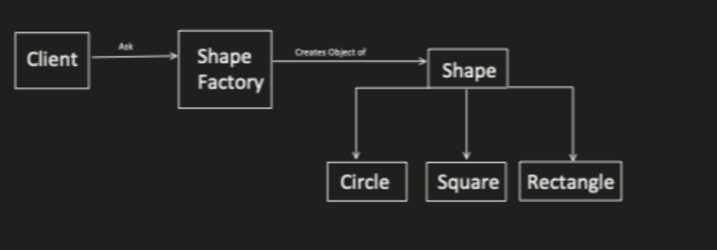
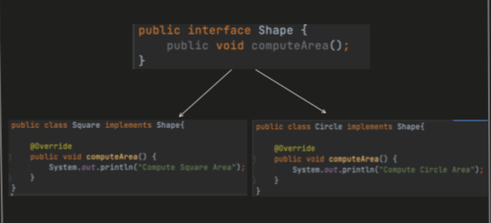
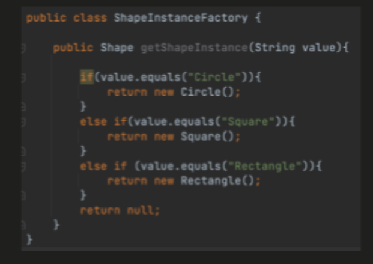
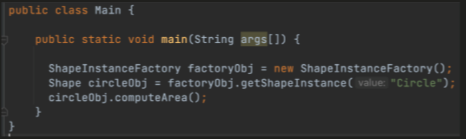

# Factory Pattern
- It's the Creational Design Pattern.
    - Creational Design Patterns provides the various object creation mechanisms, which increase the flexibility and reusability of existing code.

- It is used when all the object creation and its business logic we need to keep at one place.
>Diagram











### Why Use the Factory Pattern?

1. **Encapsulation of Object Creation**:
   - The Factory Pattern encapsulates the logic of object creation, keeping it separate from the business logic. This centralization makes the system easier to manage and extend.

2. **Avoiding Code Duplication**:
   - When you need to instantiate the same object in many places, the Factory Pattern helps avoid code duplication by centralizing the instantiation logic.

3. **Simplifying Object Creation Logic**:
   - Complex object creation logic is moved to the factory, making the client code simpler and cleaner.

4. **Promoting Flexibility and Scalability**:
   - The pattern makes it easier to introduce new types of objects without changing the client code, enhancing the system’s flexibility and scalability.

### When to Use the Factory Pattern?

1. **When Object Creation Logic is Complex**:
   - If the logic for creating an object is complex or involves many parameters, a factory can simplify this process.

2. **When the Type of Object Needs to be Decided at Runtime**:
   - If the specific type of object to instantiate is determined based on some runtime conditions or configuration, a factory can handle this decision-making.

3. **When You Need to Avoid Tight Coupling**:
   - Factories help decouple client code from the concrete classes it needs to instantiate, promoting a more modular and maintainable codebase.

4. **When You Want to Adhere to SOLID Principles**:
   - Using factories aligns with the SOLID principles, particularly the Single Responsibility Principle (SRP) and the Dependency Inversion Principle (DIP).

### Example Scenario

Consider a notification system where the method of sending notifications (Email, SMS, Push) depends on the user's preferences. Using the Factory Pattern, you can streamline the instantiation process:

```java
// Notification.java
public interface Notification {
    void send(String message);
}

// EmailNotification.java
public class EmailNotification implements Notification {
    @Override
    public void send(String message) {
        // Email sending logic
    }
}

// SMSNotification.java
public class SMSNotification implements Notification {
    @Override
    public void send(String message) {
        // SMS sending logic
    }
}

// PushNotification.java
public class PushNotification implements Notification {
    @Override
    public void send(String message) {
        // Push notification logic
    }
}

// NotificationFactory.java
public class NotificationFactory {
    public static Notification createNotification(String channel) {
        switch (channel.toLowerCase()) {
            case "email":
                return new EmailNotification();
            case "sms":
                return new SMSNotification();
            case "push":
                return new PushNotification();
            default:
                throw new IllegalArgumentException("Unknown channel: " + channel);
        }
    }
}

// Usage
public class NotificationService {
    public void sendNotification(String channel, String message) {
        Notification notification = NotificationFactory.createNotification(channel);
        notification.send(message);
    }
}
```

In this example, the `NotificationFactory` handles the creation of notification objects based on the specified channel, keeping the `NotificationService` code clean and decoupled from the specifics of each notification type.

---

This structured explanation should help clarify the purpose and usage of the Factory Pattern.