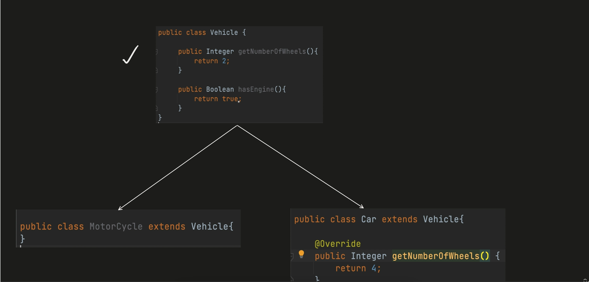

### Liskov Substitution Prinicple - Explanation, Problem & Solution

> We should be able to swap/substitute the objects of subclass with objects of superclass without breaking the application.

**Here, from the above picture we can replace Parent parentObj with Child new C1(), C2(), or with any other child class.**

Example:

> Vehicle Class and it has two things, getNumberOfWheels() by default it returns 2 and hasEngine() by default it returns true. 

- Now, we have a Car class which extends Vehicle class and has a method getNumberOfWheels() which returns 4 and we didnt overrided hasEngine() method. 

- Now, we have a Bike class which extends Vehicle class and now need to override getNumberOfWheels() method as bike will have 2 wheels and hasEngine() method as bike has engine. 

**</Client Code>**

- Now, we are iterating over the list of vehicles and calling hasEngine() method.
    - If we run the above code, we will get the output as true for all the vehicles.
---
**When Problem will Occur?**
> Now when problem will occur? If we have a vehicle which doesnt have engine, then we need to override hasEngine() method in Vehicle class and return **false**.

> But, if we do this then we are breaking the Liskov Substitution Principle as we are changing the behavior of the parent class in the child class and its downsizing the capability of the parent class.

Now we have a Bicycle class which extends Vehicle class and we have overridden hasEngine() method and as bicycle doesnt have engine, we are returning **null**.

**</Client Code>**
 

>now if we run the above code, for Bicycle object we will get null as output, and it will result in **null pointer exception**.

This is downsizing the capability of the parent class and breaking the Liskov Substitution Principle.

> To fix the above issue: we might have to add the if else condition in the client code to check if the object is of Bicycle class or if it is the Instance of Bicycle class then dont call hasEngine() method.

**This is the problem with the Liskov Substitution Principle.**

----
**What's the Solution to overcome this Problem?**

> What we can do is, we will put the generic Method which are very common for all.

> Here we have added a very generic method getNumberOfWheels() in the Vehicle class and we have two classes EngineVehicle and Bicycle which extends Vehicle class.

> And now from EngineVehicle class we have created Car adn MotorBike class which extends EngineVehicle class.

> And for Bicycle class we have taken from Vehicle class, so it doesnt have engine.

> From the EngineVehicle class we have two child class Car and MotorBike which has engine.

*Now let's see the client code.*

**</Client Code>**

- Here we are creating list of Vehicle and adding Car, MotorBike and Bicycle objects to the list.
- And we are iterating over the list and calling getNumberOfWheels().toString() method.
- Now this code has no chance of breaking as we have put the generic method in the Vehicle class, so we dont have to worry about the child class.

*Let's see another client code.*

**</Client Code>**

- Here we are creating list of Vehicle and adding Car, MotorBike and Bicycle objects to the list.
- And we are iterating over the list and calling hasEngine(). method.
- **Are we will be able to call hasEngine() method** - No, we wont able to access it as Vehicle class is not aware of hasEngine() method, we will able to access only the methods which are in the Vehicle class. So this will result in **Compile Time Error**.    

*Let's see another example.*

**</Client Code>**

- Here we are creating list of EngineVehicle and we can add  Car and MotorBike objects to the list.
- **But can we add Bicycle object to the list of EngineVehicle** - No, we wont able to add Bicycle object to the list of EngineVehicle as Bicycle is not the instance of EngineVehicle. So this will result in **Compile Time Error**.

**This is how we can overcome the problem of Liskov Substitution Principle.**
**We just have to use Inheritance in a proper way.**